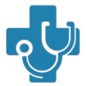

# Teh NP KE Sharktank 2025 NPO Winning Project

🎈🎉🎉🎉🎉🎉🎉🎈

# 🚑 Fix-It: Healthcare on the Move! 🇰🇪

Welcome to **Fix-It**, a non-profit tech-and-tools initiative dedicated to closing the healthcare gap in Kenya. We believe that your location shouldn't determine your lifespan.

## 🌟 The Mission
In many parts of Kenya, the nearest doctor is miles away, and the medic-to-patient ratio is a staggering **1:8000**. Fix-It isn't waiting for patients to come to the hospital—**we’re taking the hospital to the patients.**

From mobile clinics on wheels to supply boats on the water, we provide "last-mile" medical services to underserved communities with a touch of family-style care.

---

## 🛠️ What’s Inside the Kit?

### **The Services**
* **🚨 Emergency & Trauma:** Rapid response and stabilization when every second counts.
* **👶 Maternal & Child Health:** Ensuring moms and little ones get the prenatal and pediatric care they deserve.
* **🎗️ HIV/AIDS Awareness:** Routine testing and education to keep communities healthy and informed.
* **🩺 Primary Healthcare:** Your friendly neighborhood check-up, brought right to your doorstep.

### **The Fleet**
* **Mobile Clinics:** Fully-loaded vans and buses that serve as exam rooms on the go.
* **Supply Vehicles:** Pickup trucks and specialized boats for those hard-to-reach places.
* **Telemedicine (In Progress):** Connecting rural patients with top-tier specialists via the web.

---

## 📊 The Numbers (Why We Do This)
* **56%** of births currently receive unskilled help—we want to change that.
* **46%** of mothers lack proper maternal care.
* **5%** child mortality rate is a number we are working to bring down to zero.

---

## 💻 Tech Stack
This landing page was built with simplicity and accessibility in mind:
* **HTML5:** Semantic structure for better SEO and screen-reader support.
* **CSS3:** Custom layouts and a sleek "blob-style" design.
* **JavaScript (Vanilla):** Interactive service accordions and a dynamic background dot-grid.

---

## 🚀 Get Involved
Want to help us "Fix-It"? We’re always looking for:
-   **Volunteers:** Medical pros, techies, and organizers.
-   **Donors:** Help us keep the gas tanks full and the medicine cabinets stocked.
-   **Advocates:** Spread the word about mobile health in Kenya!

### **Let's Connect!**
📍 **Based in:** Kenya  
🌐 **Website:** [bit.ly/fixitorg](https://bit.ly/fixitorg/)  
📸 **Instagram:** [@fixit_healthcare](https://instagram.com/@fixit_healthcare)  
🐦 **X (Twitter):** [@fixit_care](https://x.com/fixit_care)  

---
*Designed with ❤️ for Kenya.*
